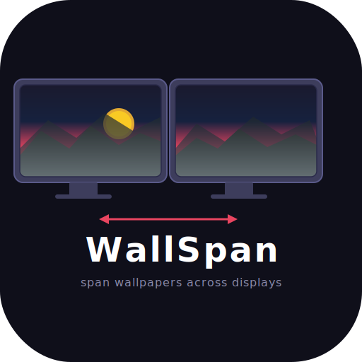

# WallSpan

<p align="center">
  
</p>

A simple macOS app to span a single wallpaper across multiple monitors.

  

## Why?

Setting a wallpaper that spans across multiple monitors on macOS shouldn't require a paid app or an outdated tool. The existing options were either behind a paywall or abandoned GitHub repos that no longer work on modern macOS. So I built WallSpan — a simple, free, open-source alternative with the help of AI.

## Features

- **Span across monitors** — splits a single image across all displays with proper aspect-ratio cropping
- **Same on all** — set one image on every monitor
- **Monitor detection** — automatically detects all connected displays and shows their arrangement
- **System wallpapers** — browse wallpapers already on your Mac (full-resolution only)
- **External images** — add any image from disk
- **Current wallpaper** — shows what's currently set on each display

## Install

### Download (easiest)

1. Grab `WallSpan-v1.0.0-macOS.zip` from the [Releases](https://github.com/hishamhaniffa/wallspan/releases) page
2. Unzip and move `WallSpan.app` to your Applications folder
3. Double-click to launch

> On first launch, macOS may block the app since it's unsigned. Go to **System Settings → Privacy & Security** and click **Open Anyway**.

### Build from source

```bash
git clone https://github.com/hishamhaniffa/wallspan.git
cd wallspan
swift build -c release
```

The binary will be at `.build/release/WallSpan`. Run it directly or use the included `dist/` structure to create your own `.app` bundle.

## How it works

- Uses `NSWorkspace.setDesktopImageURL` to set wallpapers per-screen
- For spanning, `ImageSplitter` computes each monitor's portion of the image using cover/fill scaling (maintains aspect ratio, no stretching), crops via CoreGraphics, and sets each piece on its corresponding display
- Monitor arrangement is read from `NSScreen.screens` with display UUIDs mapped via `CGDisplayCreateUUIDFromDisplayID`

## Requirements

- macOS 13 (Ventura) or later
- Tested on macOS Tahoe with dual 4K monitors

## Contributing

The full source is here for anyone to modify as needed. PRs welcome.

## License

MIT
